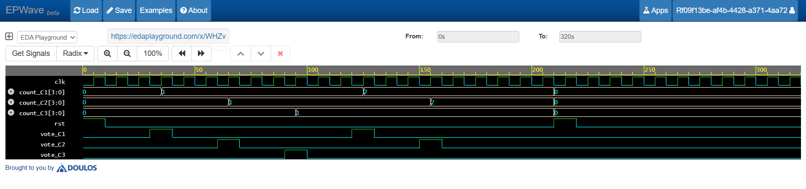

# Verilog Voting Machine Project


A simple **Digital Voting Machine designed using Verilog/SystemVerilog HDL**. The project supports voting for three candidates and maintains an individual vote count for each candidate.

## 🔗 EDA Playground

[**Run the Voting Machine on EDA Playground →**](https://www.edaplayground.com/x/Qxvc)

## 📖 Overview

This project demonstrates the design and simulation of a basic **digital voting machine** using HDL.

The system accepts vote inputs for three candidates. Whenever a valid vote is received, the corresponding candidate's vote counter is incremented. A reset signal is provided to clear all vote counts and start a new voting session.

The project is intended for learning and practicing:

* Verilog/SystemVerilog HDL
* Digital logic design
* RTL design
* Testbench development
* Simulation and waveform analysis

## ✨ Features

* Supports **three candidates**
* Maintains a separate vote count for each candidate
* Increments the selected candidate's vote count
* Provides a reset function to clear all votes
* Includes a dedicated testbench
* Simulation compatible with **Icarus Verilog**
* Can be simulated using **EDA Playground**
* Waveform can be viewed using **GTKWave**

## 📁 Project Structure

```text
Voting-Machine-Using-Verilog/
│
├── design.sv       # Main voting machine design
├── testbench.sv    # Testbench for verification
├── waveform.png    # Simulation waveform
└── README.md       # Project documentation
```

## ⚙️ Working Principle

The voting machine uses the following signals:

| Signal            | Description                                |
| ----------------- | ------------------------------------------ |
| `clk`             | Clock signal for synchronous operation     |
| `rst`             | Reset signal that clears all vote counters |
| `vote_C1`         | Vote input for Candidate 1                 |
| `vote_C2`         | Vote input for Candidate 2                 |
| `vote_C3`         | Vote input for Candidate 3                 |
| Candidate 1 Count | Stores votes received by Candidate 1       |
| Candidate 2 Count | Stores votes received by Candidate 2       |
| Candidate 3 Count | Stores votes received by Candidate 3       |

### Operation

1. The system starts with all vote counters set to zero.
2. When `rst` is activated, all vote counters are cleared.
3. A pulse on `vote_C1` increments Candidate 1's vote count.
4. A pulse on `vote_C2` increments Candidate 2's vote count.
5. A pulse on `vote_C3` increments Candidate 3's vote count.
6. Multiple votes can be recorded for each candidate.
7. The current vote counts can be observed during simulation.

## 🧪 Simulation

### EDA Playground

1. Open the [EDA Playground project](https://www.edaplayground.com/x/Qxvc).
2. Select **Icarus Verilog** as the simulator.
3. Run the simulation.
4. Observe the output and waveform.

### Local Simulation Using Icarus Verilog

Clone the repository:

```bash
git clone https://github.com/sushobhitjajoriya9/Voting-Machine-Using-Verilog.git
cd Voting-Machine-Using-Verilog
```

Compile the design and testbench:

```bash
iverilog -g2012 -o voting_machine_sim design.sv testbench.sv
```

Run the simulation:

```bash
vvp voting_machine_sim
```

## 📊 Waveform

The simulation waveform shows the clock, reset, vote inputs, and corresponding candidate vote counters.



### Signals Observed

* `clk` — Clock signal
* `rst` — Reset signal
* `vote_C1` — Candidate 1 voting input
* `vote_C2` — Candidate 2 voting input
* `vote_C3` — Candidate 3 voting input
* Candidate vote counters — Updated vote totals

## 🔬 Waveform Generation

If you want to generate a VCD waveform locally, add the following commands to `testbench.sv`:

```verilog
$dumpfile("voting_machine.vcd");
$dumpvars(0, testbench);
```

Then run:

```bash
iverilog -g2012 -o voting_machine_sim design.sv testbench.sv
vvp voting_machine_sim
```

Open the generated waveform using GTKWave:

```bash
gtkwave voting_machine.vcd
```

## 🛠️ Technologies Used

* **Verilog/SystemVerilog HDL**
* **EDA Playground**
* **Icarus Verilog**
* **GTKWave**
* **GitHub**

## 🚀 Future Improvements

The project can be extended with:

* More than three candidates
* Seven-segment display output
* LCD/OLED display
* Vote validation
* Voting enable/disable control
* Winner detection
* Tie detection
* FPGA implementation
* Password or authentication mechanism
* Total vote counter

## 🎯 Applications

This project can be used as a basic example for:

* Digital voting machine design
* RTL design practice
* Verilog/SystemVerilog learning
* FPGA projects
* Digital electronics laboratory work
* HDL simulation and verification

## 👨‍💻 Author

**Sushobhit Jajoriya**

GitHub: [@sushobhitjajoriya9](https://github.com/sushobhitjajoriya9)

---

⭐ If you find this project useful, consider giving the repository a **star**!
